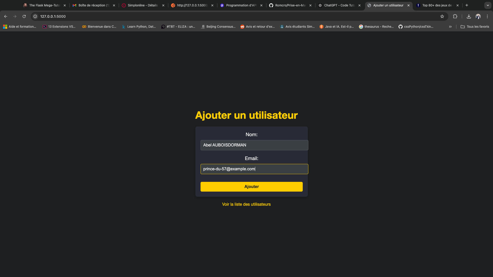
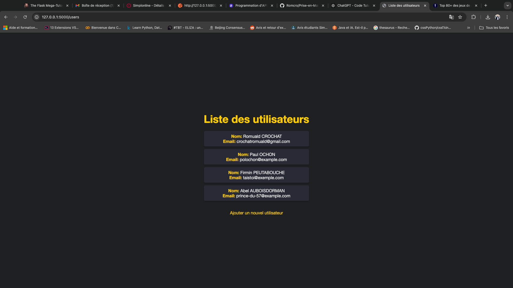
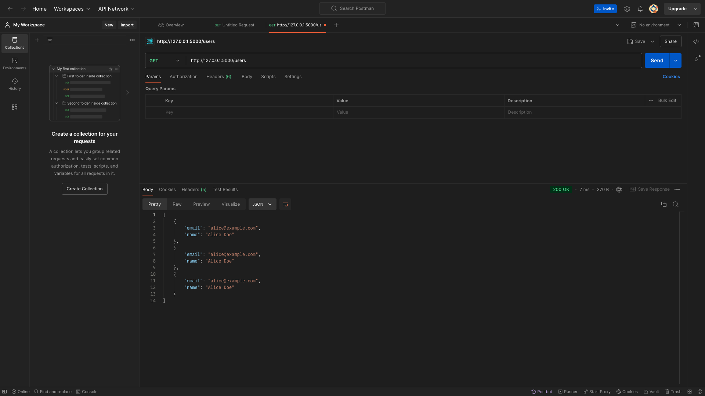
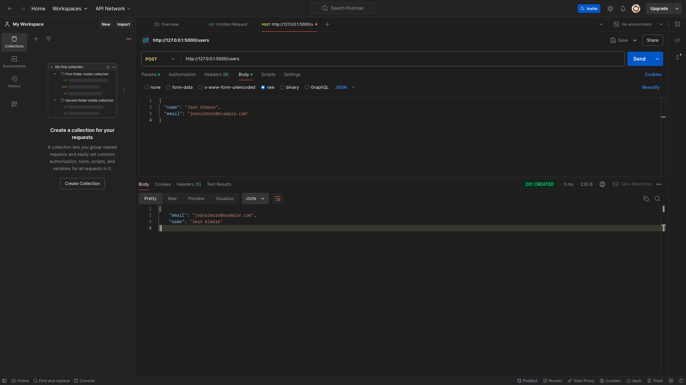
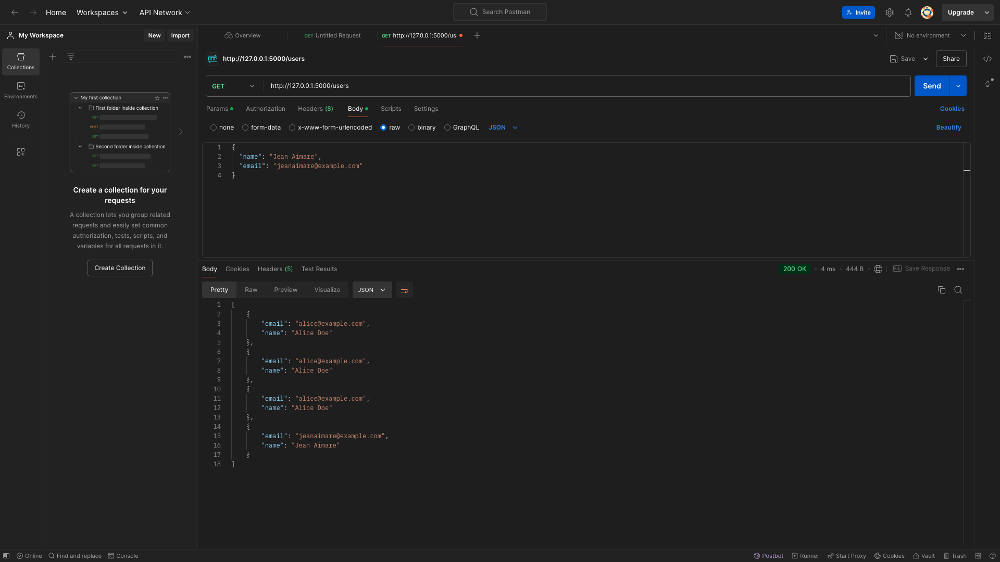

# Application Flask - Gestion d'utilisateurs

## Description du projet

Ce projet est une application simple développée avec Flask qui permet de :

1. Ajouter des utilisateurs via une interface graphique.
2. Lister les utilisateurs ajoutés via une page dédiée.
3. Tester l'API via Postman et l'extension REST Client dans VSCode.

### Fonctionnalités

- Interface utilisateur pour l'ajout d'utilisateurs.
- API REST avec deux routes :
  - **GET** `/users` : Récupère la liste des utilisateurs.
  - **POST** `/users` : Ajoute un nouvel utilisateur à la liste.

---

## Installation

### Prérequis

1. Python 3.x doit être installé sur votre machine.
2. Flask doit être installé dans votre environnement Python.
3. Un environnement virtuel Python est recommandé.

### Étapes

1. Clonez le dépôt du projet sur votre machine :

```bash
git clone https://votre-depot.git
```

2. Accédez au dossier du projet :

```bash
cd Prise-en-Main-de-Flask
```

3. Créez et activez un environnement virtuel :

```bash
python3 -m venv .venv
source .venv/bin/activate  # Sur macOS ou Linux
```

4. Installez les dépendances requises :

```bash
pip install -r requirements.txt
```

5. Lancez l'application :

```bash
python3 run.py
```

L'application sera accessible sur `http://127.0.0.1:5000`.

---

## Utilisation

### Interface graphique

1. Pour ajouter un utilisateur, rendez-vous sur la page d'accueil de l'application via `http://127.0.0.1:5000`.



2. Remplissez le formulaire avec le nom et l'email de l'utilisateur puis cliquez sur "Ajouter". Vous serez redirigé vers la liste des utilisateurs.



3. La liste des utilisateurs peut également être consultée à l'adresse `http://127.0.0.1:5000/users`.

---

### API REST

#### Tester avec Postman

1. **GET** `/users` : Pour récupérer la liste des utilisateurs.



2. **POST** `/users` : Pour ajouter un utilisateur via l'API.



3. **GET** `/users` après ajout : Pour vérifier que l'utilisateur a bien été ajouté.



#### Tester avec REST Client dans VSCode

1. **GET** `/users` : Récupérer la liste des utilisateurs.

```http
GET http://127.0.0.1:5000/users
```

2. **POST** `/users` : Ajouter un utilisateur.

```http
POST http://127.0.0.1:5000/users
Content-Type: application/json

{
  "name": "Jean Aimare",
  "email": "jeanaimare@example.com"
}
```

---

## Structure du projet

```plaintext
Prise-en-Main-de-Flask/
│
├── app/
│   ├── __init__.py
│   ├── routes.py
│
├── static/
│   └── css/
│       └── style.css
│
├── templates/
│   ├── index.html
│   └── list_users.html
│
├── data/
│   └── users.json
│
├── config.py
├── run.py
├── requirements.txt
└── README.md
```

---

### **Phase 3 : Gestion des sessions et sécurité des mots de passe**

Dans cette phase, nous avons ajouté des fonctionnalités essentielles de sécurité pour protéger les données des utilisateurs et gérer les connexions sécurisées.

#### **1. Hashage des mots de passe**

Tous les mots de passe des utilisateurs sont hashés avant d'être stockés dans le fichier **`users.json`**. Le hashage est effectué avec la méthode **`generate_password_hash`** de la bibliothèque **`werkzeug.security`**, qui applique un algorithme de hachage sécurisé. Cela garantit que les mots de passe ne sont jamais stockés en clair, et donc qu'ils ne peuvent pas être compromis facilement.

Lors de la connexion, nous utilisons la méthode **`check_password_hash`** pour vérifier que le mot de passe entré par l'utilisateur correspond bien au mot de passe stocké de manière sécurisée.

Exemple de code pour le hashage et la vérification du mot de passe :

```python
# Hashage du mot de passe
hashed_password = generate_password_hash(password)

# Vérification du mot de passe lors de la connexion
if check_password_hash(user['password'], password):
    # Connexion réussie
```

#### **2. Gestion des sessions utilisateur**

Flask fournit un système de gestion des sessions via des cookies sécurisés. Lorsqu'un utilisateur s'inscrit ou se connecte, son nom est stocké dans la session via **`session['user']`**, ce qui permet de le reconnaître lors de ses futures visites. Cela nous permet de restreindre l'accès à certaines parties de l'application, comme le tableau de bord, aux utilisateurs connectés.

Exemple de gestion de session après connexion :

```python
session['user'] = user['name']  # Stocker le nom de l'utilisateur dans la session
```

#### **3. Déconnexion**

Les utilisateurs peuvent se déconnecter à tout moment. Lors de la déconnexion, la session est vidée avec **`session.pop('user')`**, ce qui met fin à la session et renvoie l'utilisateur à la page de connexion.

#### **4. Sécurisation des sessions avec une clé secrète**

Pour sécuriser la gestion des sessions, une clé secrète est utilisée dans l'application Flask. Cette clé est chargée depuis un fichier **`.env`** afin de ne pas être exposée dans le code source. Cela permet de protéger l'intégrité des sessions utilisateur.

Voici un exemple de configuration de la clé secrète dans **`__init__.py`** :

```python
# Charger les variables d'environnement
load_dotenv()

# Créer l'application Flask
app = Flask(__name__)

# Configurer la clé secrète pour sécuriser les sessions
app.config['SECRET_KEY'] = os.getenv('SECRET_KEY')
```

#### **5. Accès sécurisé au tableau de bord**

L'accès au tableau de bord est restreint aux utilisateurs connectés. Si un utilisateur essaie d'accéder au tableau de bord sans être connecté, il sera redirigé vers la page de connexion.

Voici un exemple de contrôle d'accès au tableau de bord :

```python
@app.route('/dashboard')
def dashboard():
    if 'user' in session:
        # L'utilisateur est connecté, accès au tableau de bord
        return render_template('dashboard.html', user=session['user'])
    else:
        # Rediriger vers la page de connexion si l'utilisateur n'est pas connecté
        flash('Veuillez vous connecter pour accéder à cette page.', 'error')
        return redirect(url_for('login'))
```

### Conclusion

Cette phase a permis d'ajouter une couche de sécurité importante à l'application. Le hashage des mots de passe protège les informations sensibles des utilisateurs, et la gestion des sessions garantit que seuls les utilisateurs connectés peuvent accéder à certaines parties de l'application.

## Auteurs

- **Romuald CROCHAT** - Développeur IA en formation

---

## License

Ce projet est sous licence MIT.
